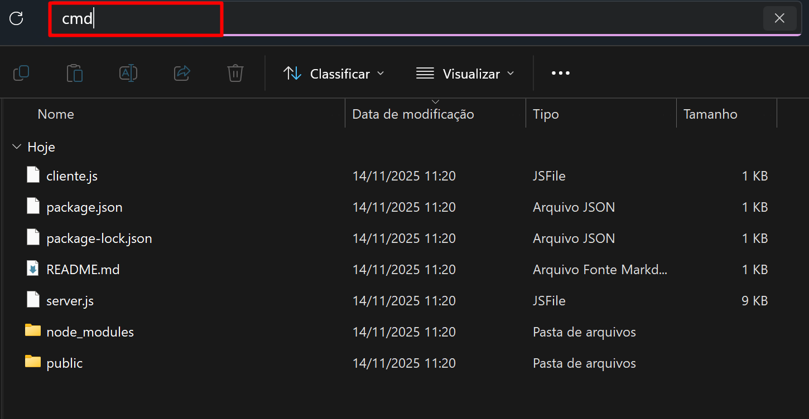
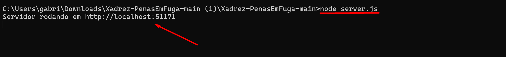
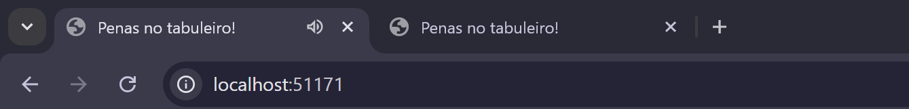

# Penas no tabuleiro!
### Como rodar o jogo localmente:

Primeiramente, realizar o download do projeto e extrair o arquivo .zip
em uma pasta da sua preferência.

Após extraído o arquivo, abra o cmd no diretório raiz do projeto:

No cmd, utilize o comando "node server.js", após isso estará disponível a porta 51171

No Chrome, abra duas abas com o a porta http://localhost:51171/

Após aberto as duas abas, o jogo estará disponível!